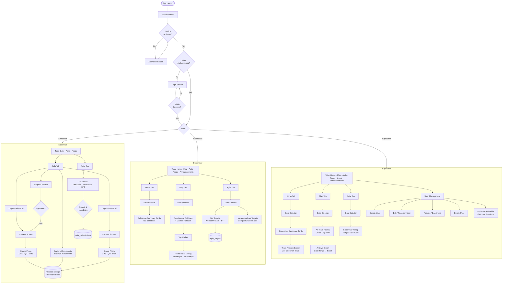

# Sales Agile Monitoring

Sales Agile Monitoring is a multi-role Flutter + Firebase app for field sales operations. It combines daily route capture, team map monitoring, Agile target setting, Agile performance submissions, and superuser administration in one codebase.

## Overview

The app supports three roles:

- **Salesman** — capture first and last calls, upload stamped photos, and submit daily Agile actuals.
- **Supervisor** — monitor assigned salesmen, review routes on the map, set daily Agile targets, and compare targets vs actuals.
- **Superuser** — view all teams, manage users, review global route activity, inspect Agile summaries, and archive route data.

## Main Features

### Salesman

- Email/password authentication.
- Calls tab for first-call and last-call capture.
- GPS-tagged photo capture with overlay details and QR map link.
- Firebase Storage upload plus Firestore route persistence.
- Checkpoint capture during the workday.
- Retake request and approval flow for call images.
- Agile tab for daily submission of:
  - total calls
  - productive calls
  - STT actual sale
- Validation that prevents invalid Agile submissions and locks finalized entries.
- **Feeds tab** — real-time timeline of active announcements from supervisors and superusers.
  - Tap any card to open a focused dim-overlay view.
  - Heart (like) button to react to announcements (one-way; cannot unlike).

### Supervisor

- Home tab showing assigned salesmen and latest call status for the selected day.
- Map tab with date-based filtering of team routes.
- Interactive map markers and route detail previews.
- Road-aware polylines with cached fallback behavior for offline or failed route resolution.
- Agile tab for daily target management per salesman:
  - productive calls target
  - STT target
- Historical Agile review by date with compact and wide card layouts.
- **Announcements tab** — create, edit, and delete announcements with optional image attachments.
  - Images are compressed before upload (max 1280 px, JPEG quality 35).
  - Audience targeting: own team only, or all staff.
- **Feeds tab** — same timeline view as salesman, with two-way heart toggle.

### Superuser

- Home tab showing supervisor team summaries.
- Map tab showing all routes for the selected day.
- Archive flow for exporting route data over a date range.
- Agile tab showing supervisor-level rollups of targets and actuals.
- Preview pages for drilling into team and salesman performance.
- User management:
  - creating users
  - editing user assignments
  - activating or deactivating accounts
  - deleting accounts
  - updating authentication credentials via Cloud Functions
- **Announcements tab** — full announcement management across all teams.
- **Feeds tab** — global timeline with two-way heart toggle.

## App Flowchart



## Tech Stack

| Category | Packages |
|---|---|
| Framework | Flutter (Dart SDK ^3.11.4) |
| Auth & Backend | `firebase_auth`, `cloud_firestore`, `firebase_storage`, `cloud_functions`, `firebase_core` |
| State Management | `provider` |
| Maps | `flutter_map`, `latlong2` |
| Location | `geolocator` |
| Camera & Vision | `camera`, `google_mlkit_face_detection`, `image_picker`, `image` |
| Networking | `http`, `dio` |
| Export & Files | `archive`, `excel`, `saver_gallery`, `path_provider` |
| UI & Utils | `intl`, `uuid`, `qr`, `cached_network_image`, `url_launcher`, `android_intent_plus` |

## App Structure

```
lib/
  app_router.dart
  main.dart
  constants/
  models/
  providers/
  screens/
    salesman/
    supervisor/
    superuser/
  services/
  widgets/
functions/
firestore.rules
storage.rules
```

## Key Screens

### Salesman

- **Calls** — first/last call workflow, checkpoint capture, and route image upload.
- **Agile** — daily form submission after call completion.
- **Feeds** — announcement timeline with heart reactions (like only).

### Supervisor

- **Home** — assigned salesmen summary cards.
- **Map** — route visualization and call inspection.
- **Agile** — target input and actual comparison by salesman and date.
- **Feeds** — announcement timeline with heart reactions.
- **Announcements** — create, edit, and delete announcements with image attachments.

### Superuser

- **Home** — supervisor team overview.
- **Map** — global route operations view and archive action.
- **Agile** — supervisor-level performance overview.
- **Feeds** — global announcement timeline with heart reactions.
- **User Management** — account lifecycle and role assignment.
- **Announcements** — full announcement management across all teams.

## Firestore Collections

| Collection | Description |
|---|---|
| `users` | User profiles, roles, and supervisor assignments |
| `routes` | Daily route documents with call images and checkpoints |
| `agile_targets` | Daily supervisor-entered targets per salesman |
| `agile_submissions` | Daily salesman-entered actuals and submission status |
| `announcements` | Active announcements with audience, schedule, and optional image URL |
| `announcements/{id}/likes` | Per-user like records for announcement reactions |

## Security Model

- Authenticated users can read only the data relevant to their role.
- Supervisors can manage targets for their own team.
- Salesmen can submit only their own Agile actuals.
- Superusers have full access for administration and archive workflows.

See `firestore.rules` and `storage.rules` for the current rule set.

## Getting Started

### Prerequisites

- Flutter SDK installed
- Firebase project configured
- FlutterFire CLI installed

### Install

```
flutter pub get
```

### Configure Firebase

```
flutterfire configure
```

Confirm these files are in place before running:

- `lib/firebase_options.dart`
- `android/app/google-services.json`
- platform Firebase config files generated by FlutterFire

### Run the app

```
flutter run
```

Useful targets:

```
flutter run -d android
flutter run -d windows
flutter build apk
```

## Setup Notes

- Firebase setup instructions: `FIREBASE_SETUP.md`
- Quick setup checklist: `SETUP_CHECKLIST.md`
- Architecture notes: `ARCHITECTURE.md`
- Implementation notes: `IMPLEMENTATION_GUIDE.md`

## Highlights

- Role-based routing from a shared login flow.
- Animated auth transition overlay.
- Responsive card layouts for supervisor and superuser dashboards.
- Historical date selectors across Home, Map, and Agile reporting flows.
- Stamped route images with QR shortcuts to map coordinates.
- Firestore-backed Agile targets and submissions.
- Archive export support for route data.

## Development

```
flutter analyze
flutter test
flutter build apk
```

## Changelog

### v2.0.1 — May 5, 2026

- **Feeds page** added for all three roles (salesman, supervisor, superuser).
  - Real-time timeline of active and ongoing announcements.
  - Facebook-style centered cards on web (32% width, clamped 420–620 px).
  - Salesman: tap any card to open a focused dim-overlay view.
  - Heart (like) button backed by Firestore; salesman can like but not unlike.
- **Announcements page** added for supervisor and superuser.
  - Create, edit, and delete announcements with title, message, occurrence, start/end time, and audience.
  - Optional image attachment with aggressive JPEG compression before upload (max 1280 px, quality 35).
  - Edit dialog includes inline image preview and remove-image option.
- **Navigation reordered**: Feeds tab placed after Agile in all three role tab bars and navigation rails.
- **Overflow fix**: Create Announcement form wrapped in `SingleChildScrollView` to prevent bottom overflow when an image preview is attached.
- **Security**: Firestore rules updated for `announcements`, `likes`, and `notifications` sub-collections; deployed to production.

---

## Branding

- App name: Compact Sales Monitoring
- Launcher icon source: `assets/images/JoshiAO.jpg`
